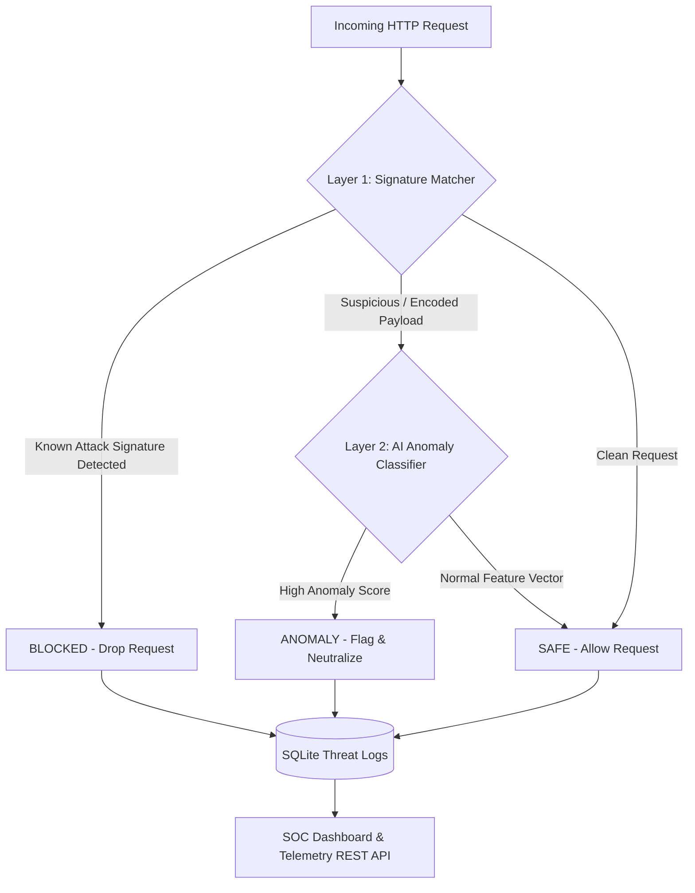

# 🛡️ AegisWAF — Next-Gen AI-Driven Web Application Security Platform

[](https://www.python.org/)
[](https://flask.palletsprojects.com/)
[](https://scikit-learn.org/)
[](https://www.sqlite.org/)
[](LICENSE)

> **AegisWAF** is an enterprise-grade, dual-layer Web Application Firewall (WAF) and real-time Security Command Center. It safeguards web applications against OWASP Top 10 security threats—including SQL Injection (SQLi), Cross-Site Scripting (XSS), Remote Code Execution (RCE), Path Traversal, SSRF, and JNDI exploits—by combining deterministic regex pattern matching with machine learning anomaly detection.

---

## 🌟 Key Features

- **⚡ Layer-1 Deterministic Signature Matcher:** Instant sub-millisecond threat mitigation screening HTTP URIs, headers, and request bodies against a curated database of attack signatures.
- **🤖 Layer-2 AI Anomaly Detector:** Calculates an 8-dimensional statistical feature vector (Shannon Entropy, length ratios, character density) to flag zero-day exploits and obfuscated payloads (URL-encoded, Hex, Unicode, Base64).
- **💻 Futuristic Command Center UI:** Single-page interface featuring dark obsidian aesthetic (`#07080c`), electric violet & cyan accents, asymmetric dashboard layout, risk meter gauge, feature radar visualization, and live rule registry.
- **📊 SOC Analytics & Threat Telemetry:** Real-time metrics breakdown, threat mitigation rates, attack vector distribution, and filterable log inspection.
- **🗄️ SQLite Persistence & RESTful API Suite:** Built-in SQLite database (`aegis_waf.db`) for structured threat logging, REST API endpoints (`/api/v1/inspect`, `/api/v1/analytics`, `/api/v1/logs`, `/api/v1/rules`), and instant CSV log exporting.

---

## 🖥️ Command Center UI & Interface Layout

```
+-----------------------------------------------------------------------------------+
|  [AW] AegisWAF   (•) SYSTEM ONLINE         [Overview] [Inspector] [SOC] [Rules]   |
+-----------------------------------------------------------------------------------+
|                                                                                   |
|  NEXT-GEN AI-DRIVEN WEB SECURITY & THREAT DEFENSE                                 |
|  Dual-Layer Hybrid Defense: Instant Signatures + Shannon Entropy ML Classifier    |
|                                                                                   |
|  +-------------------+  +-------------------+  +-----------------+  +----------+  |
|  | 1,482 Scanned     |  | 284 Mitigated     |  | 99.4% Accuracy  |  | 14.2 ms  |  |
|  +-------------------+  +-------------------+  +-----------------+  +----------+  |
|                                                                                   |
|  +-------------------------------------+  +-------------------------------------+ |
|  | HTTP Request Builder & Presets      |  | Real-Time Threat Telemetry          | |
|  | [SQLi] [XSS] [RCE] [SSRF] [Safe]     |  | [🚨 BLOCKED: SQL Injection (98.5%)] | |
|  | Method: [POST]  URI: [/search?q=...]|  | Risk Meter Bar: [|||||||||| 98.5%] | |
|  | [Analyze Payload Button]            |  | Feature Radar: Entropy, Ratio, Chars| |
|  +-------------------------------------+  +-------------------------------------+ |
|                                                                                   |
|  +------------------------------------------------------------------------------+ |
|  | SOC Threat Logs Table | [All] [Blocked] [Anomaly] [Safe] | [📥 Export CSV]   | |
|  | #45 | 2026-08-09 | 192.168.1.45 | [BLOCKED] | SQL Injection | Risk: 98.5%    | |
|  +------------------------------------------------------------------------------+ |
+-----------------------------------------------------------------------------------+
```

---

## 🏗️ Architecture & Dual-Layer Flow



---

## 🛠️ Tech Stack

| Component | Technology Used |
| :--- | :--- |
| **Backend Engine** | Python 3.8+, Flask (Modular Blueprint Architecture) |
| **Machine Learning** | Scikit-Learn, Joblib, NumPy, SciPy |
| **Database** | SQLite3 (`logs/aegis_waf.db`) |
| **Frontend UI** | HTML5, Vanilla CSS3 (Obsidian & Electric Violet Theme), JavaScript (ES6+) |
| **Typography** | Inter, JetBrains Mono |

---

## 📁 Directory Structure

```
AegisWAF/
├── app.py                      # Flask Application Entrypoint
├── setup.py                    # Package Configuration
├── requirements.txt            # Dependencies List
├── README.md                   # Project Documentation
├── LICENSE                     # MIT License
├── .gitignore                  # Git Exclusion Rules
├── logs/
│   ├── aegis_waf.db            # SQLite Threat Logs & Telemetry DB
│   └── detections.log          # System Audit Log File
├── src/
│   └── aegis_waf/
│       ├── __init__.py
│       ├── database.py         # SQLite Persistence & Analytics Engine
│       ├── models/
│       │   └── ml_model.pkl    # Trained Scikit-Learn Anomaly Classifier
│       ├── routes/
│       │   ├── main.py         # Web Page Blueprint
│       │   └── api.py          # Security REST API Blueprint (/api/v1/*)
│       └── utils/
│           ├── signature_checker.py # Layer-1 Signature Matching Engine
│           ├── preprocessor.py      # Statistical Feature Extractor & Risk Meter
│           └── ml_checker.py        # Layer-2 AI Inference Engine
├── static/
│   ├── css/
│   │   └── aegis.css           # Command Center Styling System
│   └── js/
│       └── aegis.js            # Interactive Command Center Logic
└── templates/
    └── index.html              # Master Security Command Center Interface
```

---

## 🚀 Installation & Running Locally

### 1. Install Dependencies
```bash
pip install -r requirements.txt
```

### 2. Launch AegisWAF Server
```bash
python app.py
```
Open **`http://127.0.0.1:5000`** in your browser.

---

## 🔌 Security REST API Reference

### 1. Inspect Payload
`POST /api/v1/inspect`
- **Request:**
  ```json
  {
    "method": "POST",
    "uri": "/comment/add",
    "user_request": "<script>alert('XSS')</script>"
  }
  ```
- **Response:**
  ```json
  {
    "status": "BLOCKED",
    "attack_type": "Cross-Site Scripting (XSS)",
    "risk_score": 95.0,
    "remediation": "Known attack signature detected [Cross-Site Scripting (XSS)]. Immediately dropped by Layer-1 WAF.",
    "extracted_features": {
      "URI_Length": 12,
      "URI_Entropy": 2.84,
      "Numeric_Text_Ratio": 0.0,
      "Special_Char_Count": 7
    }
  }
  ```

### 2. Get Telemetry Analytics
`GET /api/v1/analytics`
- Returns total scanned count, mitigated threat count, accuracy rate, and attack vector distribution.

### 3. Query Threat Logs
`GET /api/v1/logs?page=1&limit=20&status=BLOCKED&search=SQL`
- Returns filterable and searchable threat logs.

### 4. Export CSV Logs
`GET /api/v1/export/csv`
- Downloads standard `aegis_waf_threat_logs.csv` log file.

---

## 📜 License

This project is licensed under the **MIT License** - see the [LICENSE](LICENSE) file for details.
