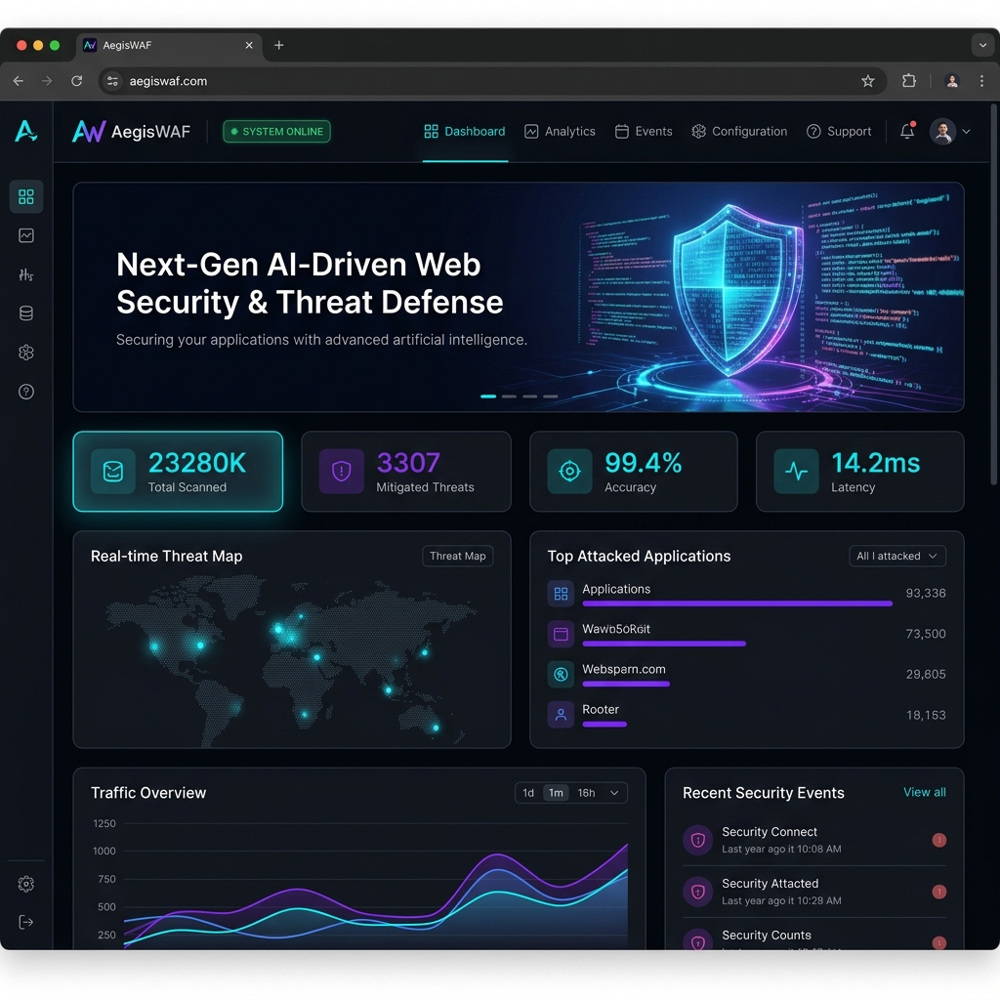
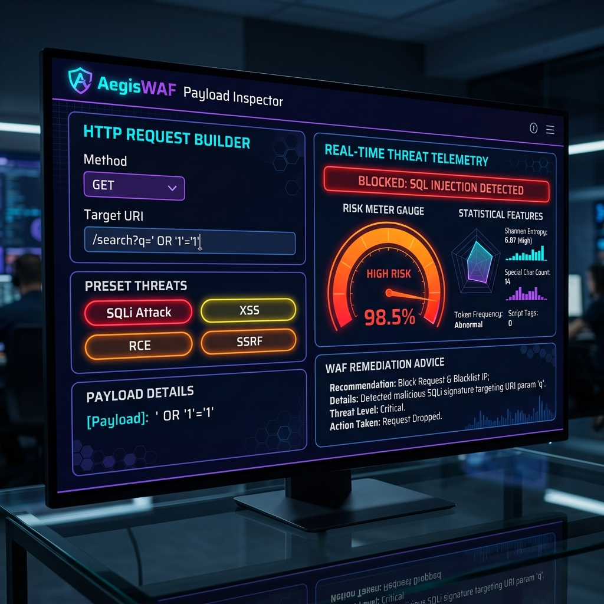
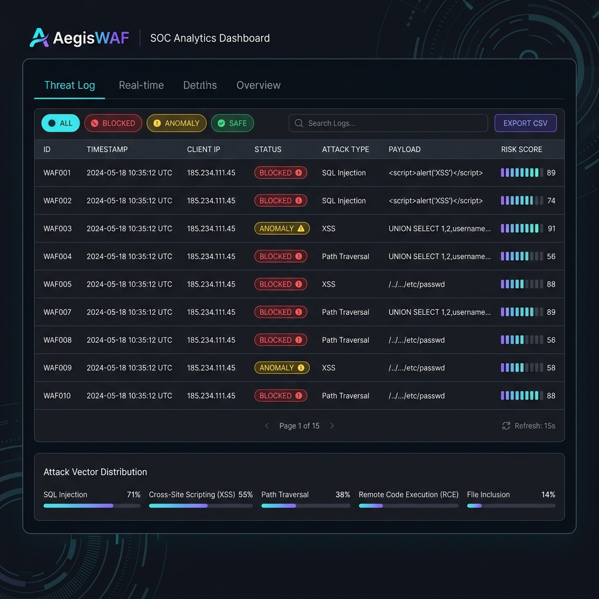

# 🛡️ AegisWAF - Next-Gen AI Web Security Command Center

<p align="center">
  
</p>

<p align="center">
  <a href="#features"></a>
  <a href="#features"></a>
  <a href="#features"></a>
  <a href="#features"></a>
  <a href="#features"></a>
</p>

> **AegisWAF** is a sleek, enterprise-grade Web Application Firewall (WAF) and real-time Security Command Center. It safeguards web applications against OWASP Top 10 security threats—such as SQL Injection (SQLi), Cross-Site Scripting (XSS), Remote Code Execution (RCE), Path Traversal, SSRF, and JNDI exploits—by combining deterministic signature pattern matching with machine learning anomaly detection.

---

## 📸 Interface Preview

<p float="left" align="center">
  
  
</p>

<p align="center">
  
</p>

---

## ✨ Features

- **⚡ Layer-1 Signature Matching:** Instant sub-millisecond threat mitigation for SQLi, XSS, RCE, Path Traversal, and SSRF.
- **🤖 Layer-2 AI Anomaly Inspector:** 8-dimensional statistical feature vector (Shannon Entropy, length ratios, special char density) to flag zero-day exploits and obfuscated payloads.
- **💻 Futuristic Command Center UI:** Single-page interface featuring dark obsidian aesthetic, electric violet & cyan accents, risk meter gauge, and feature radar charts.
- **📊 SOC Telemetry & CSV Export:** Real-time threat distribution metrics, filterable log tables, and instant `.csv` log downloads.
- **🗄️ SQLite Database Persistence:** Automatic runtime logging of all incoming request vectors.

---

## 🚀 Quick Start

```bash
# 1. Install dependencies
pip install -r requirements.txt

# 2. Run the AegisWAF Command Center
python app.py
```
Open **`http://127.0.0.1:5000`** in your browser.

---

## 📜 License

This project is licensed under the **MIT License** - see the [LICENSE](LICENSE) file for details.
